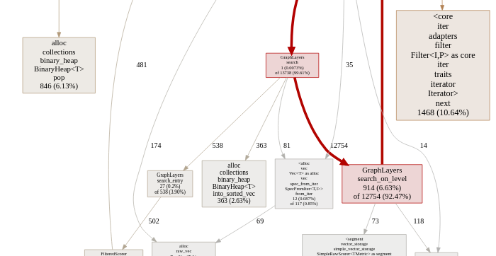

# Developer's guide to Solvio


## Profiling

There are several benchmarks implemented in Solvio. Benchmarks are not included in CI/CD and might take some time to execute.
So the expected approach to benchmarking is to run only ones which might be affected by your changes.

To run benchmark, use the following command inside a related sub-crate:

```bash
cargo bench --bench name_of_banchmark
```

In this case you will see the execution timings and, if you launched this bench earlier, the difference in execution time.

Example output:

```
scoring-vector/basic-score-point                                                                            
                        time:   [111.81 us 112.07 us 112.31 us]
                        change: [+19.567% +20.454% +21.404%] (p = 0.00 < 0.05)
                        Performance has regressed.
Found 9 outliers among 100 measurements (9.00%)
  3 (3.00%) low severe
  3 (3.00%) low mild
  2 (2.00%) high mild
  1 (1.00%) high severe
scoring-vector/basic-score-point-10x                                                                            
                        time:   [111.86 us 112.44 us 113.04 us]
                        change: [-1.6120% -0.5554% +0.5103%] (p = 0.32 > 0.05)
                        No change in performance detected.
Found 1 outliers among 100 measurements (1.00%)
  1 (1.00%) high mild
```


### FlameGraph and call-graph visualisation
To run benchmarks with profiler to generate FlameGraph - use the following command:

```bash
cargo bench --bench name_of_banchmark -- --profile-time=60
```

This command will run each benchmark iterator for `60` seconds and generate FlameGraph svg along with profiling records file.
These records could later be used to generate visualisation of the call-graph.


Use [pprof](https://github.com/google/pprof) and the following command to generate `svg` with a call graph:

```bash
~/go/bin/pprof -output=profile.svg -svg ${solvio_root}/target/criterion/${benchmark_name}/${function_name}/profile/profile.pb
```



## API changes

### REST

Solvio uses the [openapi](https://spec.openapis.org/oas/latest.html) specification to document its API.

This means changes to the API must be followed by changes to the specification.

Here is a quick step-by-step guide:

1. code endpoints and model in Rust
2. change specs in `/openapi/*ytt.yaml`
3. add new schema definitions to `src/schema_generator.rs`
4. run `/tools/generate_openapi_models.sh` to generate specs
5. move newly created openapi.json `cp docs/redoc/openapi.json docs/redoc/master/openapi.json`
6. update integration tests `openapi/tests/openapi_integration`
7. expose file by starting an HTTP server, for instance `python -m http.server`, in `/docs/redoc`
8. validate specs by browsing redoc on `http://localhost:8000/?v=master`
9. validate `openapi-merged.yaml` using [swagger editor](https://editor.swagger.io/)

### gRPC

Solvio uses [tonic](https://github.com/hyperium/tonic) to serve gRPC traffic.

Our protocol buffers are defined in `src/tonic/proto/*.proto`

1. define request and response types using protocol buffers (use [oneOf](https://developers.google.com/protocol-buffers/docs/proto3#oneof) for enums payloads)
2. specify RPC methods inside the service definition using protocol buffers
3. `cargo build --features grpc` will generate the struct definitions and a service trait
4. implement the service trait in Rust
5. start server `cargo run --bin solvio --features grpc`
6. run integration test `./tests/basic_grpc_test.sh`

Here is a good [tonic tutorial](https://github.com/hyperium/tonic/blob/master/examples/routeguide-tutorial.md#defining-the-service) for reference.